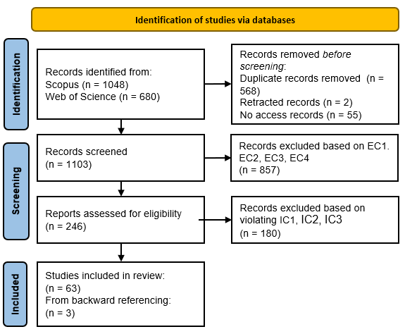

# Technical Report: Literature Search Details Across Three Iterations
## Introduction

This report documents the literature search process undertaken as part of our method to identify and review relevant works for this study. The search was conducted in three iterative stages, each with a specific objective tailored to address distinct aspects of the research focus. A detailed explanation of each iteration is presented in the following sections.

---

## Iterative Literature Search Process

### Iteration 1

The primary objective of the first iteration was to synthesise insights from existing literature on process context classifications. In this phase, we focused on identifying literature addressing context classifications related to business processes. As a starting point, we selected the paper: *Process Mining Put into Context* (van der Aalst & Dustdar, 2012) and applied the backward and forward snowballing technique (Webster & Watson, 2002) to discover additional relevant works.

Through this process, we identified a total of 102 papers across two databases: Scopus and Web of Science. To ensure the relevance and quality of selected studies, the following exclusion criteria were applied:

**EC1**: Articles inaccessible for review or  
**EC2**: Articles not written in English or  
**EC3**: Articles not peer-reviewed or  
**EC4**: Articles that do not propose a novel process context classification

After applying these criteria, only seven studies were relevant. These studies proposed novel classifications of process contexts, which serve as the basis for subsequent iterations.

---

### Iteration 2

The objective of the second iteration was to enrich the classification by incorporating theoretical foundations from the context classifications in the IoT domain. In this phase, we concentrated on exploring existing classifications and ontologies related to IoT contexts. As a starting point, we selected three recent systematic literature reviews on context-aware IoT systems and employed the backward and forward snowballing method to identify further relevant works:

1. *Context-aware computing, learning, and big data in Internet of Things: A survey* (Sezer et al., 2018)
2. *The MOM of context-aware systems: A survey* (Pradeep & Krishnamoorthy, 2019)
3. *Leveraging context-awareness for internet of things ecosystem: Representation, organization, and management of context* (Pradeep et al., 2021)

This iteration yielded 369 relevant papers from Scopus and Web of Science. The following exclusion criteria were applied to refine the selection:

**EC1**: Articles inaccessible for review or  
**EC2**: Articles not written in English or  
**EC3**: Articles not peer-reviewed or  
**EC4**: Articles discussing applications based on existing IoT classifications or  
**EC5**: Articles that do not propose new IoT classifications or  
**EC6**: Articles that do not propose new IoT ontologies  

Using these criteria, we identified 30 relevant publications that introduced novel IoT context classifications or contributed to the conceptualization of IoT ontologies. A detailed list of selected papers from the first two iterations, highlighted in green, is available at (https://tinyurl.com/4mbjfeax).

---

### Iteration 3

The goal of the third iteration was to assess whether the proposed classification satisfied the predefined ending conditions with use cases found in existing literature. Thus, in the third iteration, we aimed to identify existing use cases that apply IoT to business processes. To ensure comprehensive coverage, we conducted a systematic search targeting use cases that explore IoT-aware business processes, encompassing both business process management and the Internet of Things domain. The search query employed (Fig. 1) was adapted from prior research conducting a systematic literature review on IoT-aware business process modelling (Compagnucci et al., 2023). 

  
  
<strong>Fig 1:</strong> Search query terms for Iteration 3.

In this iteration, we used digital libraries Scopus and Web of Science, to retrieve articles based on specified search queries. In particular, we focus on literature that was published in 2013 or later, peer-reviewed and written in English. As a result, a total of 1103 studies are collected. To reduce the number of studies produced by the previous phase, we establish exclusion criteria. These criteria specify that a research work is excluded: 

**EC1**: if it fails to provide a use case or  
**EC2**: if the provided use case does not clearly outline a business process or  
**EC3**: if the use case does not apply IoT technology, or  
**EC4**: if the research study does not apply IoT technology to improve the business process. 

After this stage of study selection, 246 papers are collected. To facilitate the identification of relevant studies, we further establish the following inclusion criteria:

**IC1**: The use case must provide detailed information about the business process. According to Dumas et al. (2018), a business process is defined as “a collection of inter-related events, activities and decision points that involve a number of actors and objects, which collectively lead to an outcome that is of value to at least one customer”. Thus, the following details about the business process must be included in a use case: 1) activities that comprise the process, 2) objects and actors involved in the process.  
**IC2**: The use case should provide details about IoT entities that are involved in the process, including at least information about their names and types.  
**IC3**: The use case must thoroughly depict the interactions between IoT entities and business processes. In line with the concept “feature of interest” introduced in SOSA ontology (Janowicz et al., 2019), the use case needs to specify which particular process object is observed or manipulated by which IoT entities.

  
  
<strong>Fig 2:</strong> Study selection process for Iteration 3.

Fig.2 provides an overview of the study selection process. After assessing the inclusion criteria for IC1, IC2, and IC3, 63 pieces of literature were selected. Through an examination of backward referencing, a total of 66 articles were identified as highly relevant, as they offer use cases that align with our research objectives. After reviewing all papers and eliminating redundant use cases, 61 use cases were obtained. Details about selected use cases can be found at https://tinyurl.com/2ac43kms.

---

## Bibliography

- Compagnucci, I., et al. (2023). *A systematic literature review on IoT-aware business process modeling views, requirements and notations*. [DOI](https://doi.org/10.1007/s10270-022-01049-2)
- Dumas, M., et al. (2018). *Introduction to Business Process Management*. [DOI](https://doi.org/10.1007/978-3-662-56509-4_1)
- Janowicz, K., et al. (2019). *SOSA: A lightweight ontology for sensors, observations, samples, and actuators*. [DOI](https://doi.org/10.1016/j.websem.2018.06.003)
- Pradeep, P., et al. (2019). *The MOM of context-aware systems: A survey*. [DOI](https://doi.org/10.1016/j.comcom.2019.02.002)
- Sezer, O. B., et al. (2018). *Context-aware computing, learning, and big data in Internet of Things: A survey*. [DOI](https://doi.org/10.1109/JIOT.2017.2773600)
- van der Aalst, W. M. P., & Dustdar, S. (2012). *Process Mining Put into Context*. [DOI](https://doi.org/10.1109/MIC.2012.12)
- Webster, J., & Watson, R. T. (2002). *Analyzing the Past to Prepare for the Future: Writing a Literature Review*. JSTOR.
